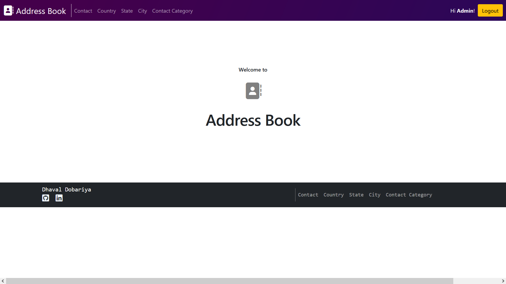
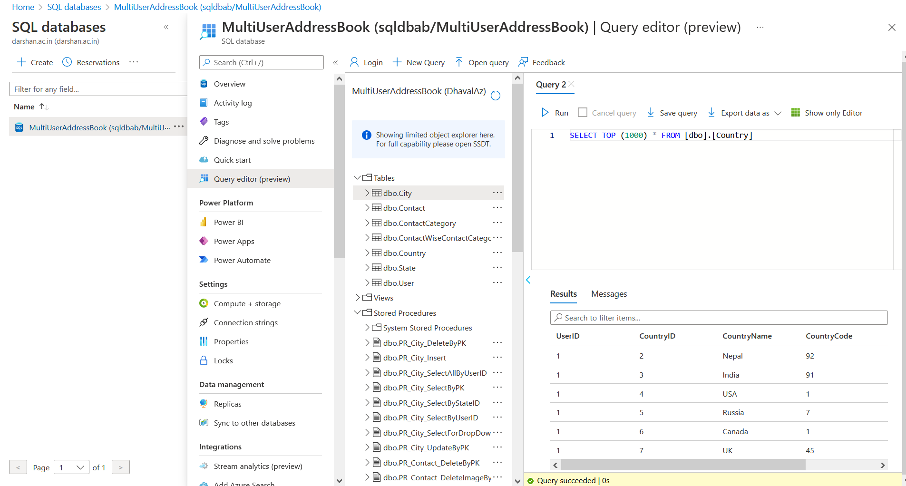

# Address Book 

This web application can manage multi-user addresses and users can register and login. User can manage contacts and their details like Country, City, State, contact categories and photo, I have used 3-tier architecture and increase performance. This web application made on ASP.NET c# and SQL server from azure.


## Tech Stack

**Client:** HTML, CSS, Bootstrap

**Server:** ASP.NET ,Azure SQL Server


## Run Locally

#### Install Visual Studio

Clone the project

```bash
  git clone https://github.com/Dhaval-DD/MultiUserAddressBook_NTier
```

Go to the project directory

```bash
  cd MultiUserAddressBook_NTier
```

Open folder click on

```bash
  MultiUserAddressBook_NTier.sln
```
its open Visual Studio
After opening project press 'ctrl + F5'


## Screenshots




